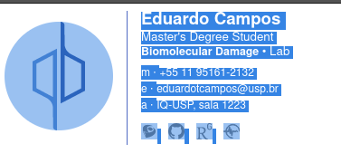
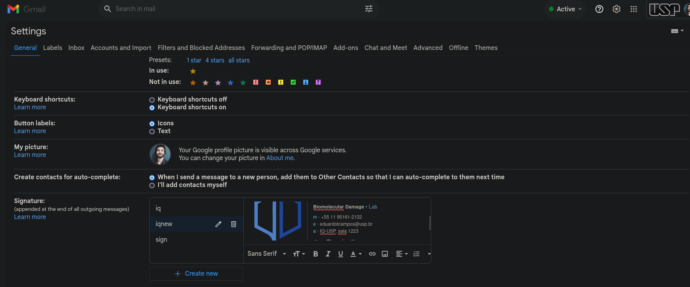

# Gmail signature example

- Html example of gmail signature, may be editted to be used as a template

- Based on [gmail-signature](https://github.com/skarif2/gmail-signature/tree/master)

- Credits to original creator [Sk Arif](https://github.com/skarif2)

## Setup Signature

- Clone the repo

```bash
git clone https://github.com/eduardotlc/gmail_signature/tree/main
```
- Open the directory and modify the [html file](./index.html) to your liking

- Open [index.html](./index.html) in any browser


- Select everything on the screen (Or use Ctr+a) and copy it



- Open your gmail account, press the settings icon (⚙️ ) and go to see all settings


- In the general tab, scroll down until you can see the signature field, and paste the previously copied signature



- Scroll down and save changes that you just made

## Notes

- There is a limit of 10,000 characters in Gmail Signature. Make sure you don't add too much stuff

Images can be converted to base64 to be embeded in case of not being avaialable online,
to do so for an svg file for example, run:

```bash
base64 <path/to/image.svg>
```

and then on [index.html](./index.html), edit the desired image source with the base64 given output, substituting <generated_bse64_output_letters> like this:

```html
<a href="https://www.link_to_desired_target_site.com" target="_blank">
  "
  >
</a>
```

Be carefull when doing this, since base64 codes can be really long and break the mentioned characters limit.

- Paths to local image files will not work when you paste your signature in Gmail. The used images need to be
in base64 format or an internet available link (this last is the used in this repo example, with the here present images)

- Only one color is given to each html element on [index.html](./index.html), so it is good practice to check the contrast
of chosen colors in white background, as so in black background.

## License

This repo available under the [MIT license](https://github.com/skarif2/gmail-signature/blob/master/LICENSE).

---
